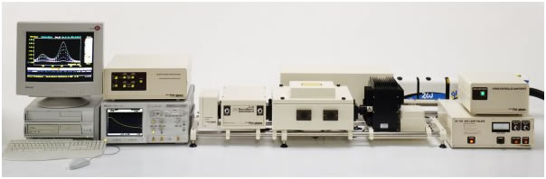
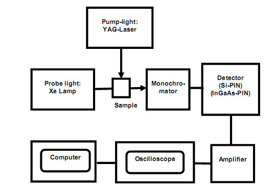

## Theory 

  <h2>Laser Flash Photolysis</h2>
  
Laser Flash Photolysis technique provides one of the most effective methods for studying by direct measurement the reactions of transient species such as radicals, excited states or ions, in chemical and biological systems. Laser flash photolysis is a commonly used fast reaction technique for photochemical reactions.

  
The use of a laser for sample excitation gives the technique the specificity of single wavelength excitation and nanosecond time resolution, and the high reproducibility of pulsed light output from the analysing source permits routine generation of time-resolved spectra over these timescales. The flash photolysis concept is very simple, a short pulse of light is used to interact with a sample that has been placed in the optical path of a spectrometer. The result of this interaction can be either a transient absorption or an emission process. The changes in detector signal taking place following laser excitation may be due to a variety of processes such as electronic excitation producing a triplet state, cleavage of a molecule producing radicals, electron transfer, molecular rearrangement etc.

  
Flash photolysis is a commonly used fast reaction technique for photochemical reactions. For reactions with a moderate rate, flash lamps provide sufficient time response. An example of a typical flash lamp is the xenon lamp in a standard camera. For very fast reactions, however, the slow decay time of the light emission from a flash lamp covers the progress of the reaction. In general the pulse width of the light source must be much shorter than the half-time of the chemical reaction. The pulse width of xenon flash lamps, such as those used in photography, is in the microsecond time scale. For faster reactions, specially designed lasers must be used that have pulse widths in the nanosecond range. Using ultra-fast pulsed lasers allows processes in the sub-femtosecond time scale to be studied. In our laser flash-photolysis system the lasers have pulse widths in the 10 nanosecond range, which allows a wide range of photochemical processes to be studied. One disadvantage of laser driven systems is that ultraviolet lasers have a fixed wavelength. Reactants in photochemical reactions can have a wide variety of absorption wavelengths, some of which may not be accessible to a given laser source. Therefore, several different types of lasers are often necessary to provide coverage of the UV range of common organic and inorganic reactants.

  
Our instrument uses a Nd-YAG laser or an eximer laser. Nd-YAG is the acronym for a neodymium-yttrium aluminum garnet solid-state laser. Nd-YAG is a synthetic "mineral" that is excited by flash lamps to produce light in the IR region of the spectrum at 1064 nm. To convert the IR light into the visible and then the UV region a special optical trick is used. Certain substances have non-linear optical properties in intense laser irradiation that combines the photons; doubling and then tripling and then quadrupling the photon frequency are possible. Potassium hydrogen phosphate is such a substance. Doubled output is at 532 nm, which is in the green region of the spectrum. Tripled output is at 355 nm and quadrupled. The laser interaction with the sample often results in irreversible changes and this necessitates sample replacement for each individual measurement (customers often use a flow-through sample arrangement to achieve this). In addition, many measurements are required to be done in the absence of oxygen and so the samples either need to be degassed using the classical freeze-pump-thaw method or by purging using an inert gas. However, some reactions processes are reversible such as the classic experiment comprising the photolysis of carboxyhaem, where green light (532nm, Nd:YAG 2nd harmonic) is used to displace carbon monoxide allowing the study of adduct interaction with the haem molecule at 266 nm. However, at each successive step the available power is greatly diminished. Output at 355 nm works well for many conjugated aromatic compounds. Eximer lasers use gas phase chemical reactions to provide highly excited diatomic molecules that emit light. The chemical reaction is initiated by an intense electrical discharge. The reaction used is normally between xenon and either fluorine or chlorine, producing either XeF or XeCl.

  
The diatomic product is produced in a highly excited state with a lifetime in the nanosecond range. In dropping back down to the ground state, light is emitted in a short pulse. XeCl provides laser emission at 308 nm with a 0.3 nm spectral width and a pulse width of about 10 ns.

  
The flash photolysis concept is very simple: a short pulse of light is used to interact with a sample that has been placed in the optical path of a spectrometer. The result of the interaction can be either a transient absorption or an emission process. The changes in detector signal taking place following laser excitation may be due to a variety of processes such as electronic excitation producing a triplet state, cleavage of a molecule producing radicals, electron transfer, molecular rearrangement etc.

### Monitoring Fast Reactions:
 

Many different techniques are available for monitoring the progress of photochemical reactions. Conductivity, IR, Raman, mass spectrometry, and chemiluminescence are all used. However, the most commonly used technique is UV/Visible spectrophotometry. A typical UV/Visible spectrometer can be used. However, the signal acquisition must be very fast. The signal from the photo detector is digitized using a very fast digital oscilloscope. This instrument is capable of collecting data at 2 GHz, that is 2x109 samples per second. However, the signal response of the detector and the amplifier electronics usually limit the time resolution to a slower sampling rate. Flash photolysis experiments are monitored at a single wavelength. However, it is often desired to determine the UV/Visible absorption spectrum of the products. There is not time enough to scan the wavelength of the monochromator of a traditional spectrophotometer during the acquisition of each time point. Diode array spectrometers are often used to acquire all the data points in a spectrum at one time. Unfortunately, the time response of diode array detectors is not sufficient for fast pulse studies. However, the experiment can easily be repeated at a series of wavelengths to piece together the spectrum of the products as a function of time. The only requirement is that enough time is allowed between experiments that the solution can return to equilibrium, usually by diffusion of reactants into the optical path of the laser. Of course, each pulse of the laser consumes reactants, so the starting concentrations must be much greater than the amount of reactants consumed during each laser pulse.

 Nanosecond Laser Flash Photometer

## Applications:
 

Finding wide application in chemical research, Laser flash photolysis has been used increasingly in the area of bioinorganic reaction mechanisms, for example, studies on electron transport in cytochromes or ligand binding by haem containing proteins. More exotic applications involving the Laser Flash Photolysis technique have recently included studies on the conformational changes of functional proteins that occur during the course of their activity. Also, the interest in this method grew considerably as the practical applications expanded from chemistry to areas such as biology, materials science, and environmental sciences. Today flash photolysis facilities are extensively used by researchers to study light-induced processes in organic molecules, polymers, nanoparticles, semiconductors, photosynthesis in plants, signaling, and light-induced conformational changes in biological systems.

Layout of laser flash photolysis

